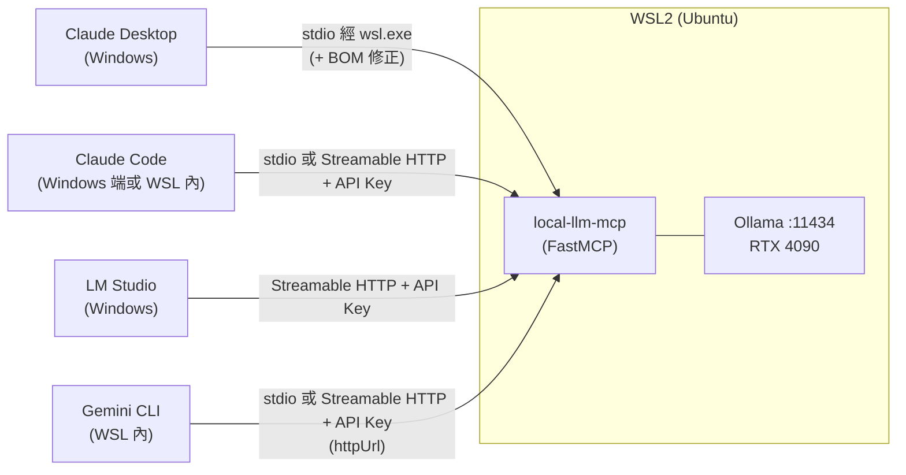

# local-llm-mcp

**一個生產等級的 MCP Server:讓 Claude Desktop、Claude Code、LM Studio、Gemini CLI 等任何 MCP client,把摘要、翻譯、資訊抽取這類敏感任務委派給本機 Ollama 上的開源模型執行 —— 文件內容全程留在本機,不經過雲端 LLM。**

完整實作 MCP 的三大 primitive(Tools / Resources / Prompts)、雙 transport(stdio / Streamable HTTP)、官方機制的 API Key 驗證,並實測橫跨四個真實 MCP client。過程中挖出並修正了兩個此前無人記錄的問題 —— 詳見下方「核心賣點」。

---

## 目錄

- [架構](#架構)
- [核心賣點](#核心賣點)
- [功能](#功能)
- [系統需求](#系統需求)
- [安裝與快速開始](#安裝與快速開始)
- [Client 安裝教學](#client-安裝教學)
- [相容性矩陣](#相容性矩陣)
- [延遲量測摘要](#延遲量測摘要)
- [Demo](#demo)
- [授權](#授權)

---

## 架構



Server 與 Ollama 都跑在 WSL2 內;四個 client 分別以自己最合適的方式連進來,**兩種 transport 都要做,不是因為每個 client 都要兩種都測,而是因為不同 client 需要不同 transport**:

- **Claude Desktop** 的 custom connector 連線從 Anthropic 雲端發起,不是本機 —— Streamable HTTP 對它沒用,**只能走 stdio**(經 `wsl.exe`)
- **Claude Code / LM Studio / Gemini CLI** 都是本機直連的 client,原生支援 Streamable HTTP + 自訂 header,用來示範 API Key 驗證的 HTTP 路徑
- LM Studio 在 Windows 原生執行,靠 WSL2 NAT 模式預設開啟的 localhost forwarding 連到 WSL 內的 server,不需要修改 `.wslconfig`

---

## 核心賣點

1. **完整的 MCP 三大 primitive + 雙 transport + 官方驗證機制** —— 6 個 tools、1 個 resource、2 個 prompt,stdio 與 Streamable HTTP 都實作,HTTP 驗證用官方 `TokenVerifier` + `AuthSettings` 機制(而非自製 middleware),不是最小可行的 tool-only demo。
2. **實測橫跨四個真實 MCP client**,涵蓋 Windows 原生程序呼叫 WSL2 內服務的跨邊界網路與程序模型細節(WSL2 NAT localhost forwarding、`wsl.exe` 程序模型、環境變數不會跨界傳遞等),不是紙上談兵的相容性宣稱。
3. **發現並修正兩個先前完全沒有文件記錄的問題**:
   - 官方 MCP Python SDK v1.x 的 `Context.report_progress()` 從未設定 `related_request_id`,導致 Streamable HTTP 下進度通知被路由到錯誤的 stream(讀 SDK 原始碼定位,對照 issue #953 / #2001 確認至今未在 v1 修復,僅修進 v2)。實作了一個 workaround helper,並用官方 client SDK 的 `progress_callback` 實測驗證 —— stdio 與 Streamable HTTP 下都收到 4 筆與 Ollama 回報位元組數精確對應的進度通知。
   - `wsl.exe` 在啟動 stdio server 時,pipe 生命週期中**第一次寫入**會被插入 3 bytes 的 UTF-8 BOM,即使 Windows 端寫入的原始 bytes 完全沒有 BOM 也一樣發生。MCP 的第一個訊息永遠是 `initialize` request,這個 BOM 會讓 JSON parser 直接失敗,導致 Claude Desktop 每次啟動都連不上。查證階段的公開文件與社群文章完全沒有提過這個現象 —— 是用 Node.js `child_process.spawn` 逐 byte 比對輸出才挖出來的,修正方式是在啟動指令中插入一段 `sed` 過濾。
4. **對「本地模型處理不可信文件」的 prompt injection 風險有具體分析與緩解設計**:輸出一律視為資料而非指令(host 端不應自動執行摘要/翻譯結果中的指令)、輸出長度上限、不做工具鏈自動串接;也記錄了若日後要把 Streamable HTTP 公開曝露(如透過 cloudflared tunnel)所需的縱深防禦考量。

---

## 功能

### Tools

| 工具 | 說明 |
|---|---|
| `ask_local` | 自由問答,直接把 prompt 丟給本機模型 |
| `summarize_private` | 摘要私密文字;超過安全字數門檻會自動依段落/句子邊界切成多個 chunk,map-reduce 方式逐段摘要後再合併,並回報處理進度 |
| `translate_private` | 中英互譯(`target_lang: "zh-TW" \| "en"`),來源語言由模型自動判斷 |
| `extract_json` | 依呼叫端在執行期提供的任意 JSON Schema 抽取結構化資料,溫度固定為 0(用 Ollama 的 `format=` 結構化輸出,而非 SDK 靜態 `outputSchema` 推導) |
| `list_local_models` | 列出本機所有 Ollama 模型(`parameter_size`、`quantization_level`、`family`、`context_length`) |
| `pull_model` | 下載 Ollama 模型,透過 MCP progress 通知回報下載進度 |

### Resource

| Resource | 說明 |
|---|---|
| `models://local` | 本機模型清單的快照 —— 與 `list_local_models` 共用同一份底層邏輯,但走「GET 目前狀態」的 Resource 語意,而非「執行動作」的 Tool 語意 |

### Prompts

| Prompt | 說明 |
|---|---|
| `summarize_for_report` | 把文字包裝成「請摘要成適合放進正式報告的語氣」的指令模板 |
| `translate_formal` | 把文字包裝成「請用正式書面語互譯中英文」的指令模板 |

---

## 系統需求

- Windows 11 + WSL2(開發與實測環境的發行版為 Ubuntu;server 與 Ollama 都跑在 WSL2 內)
- NVIDIA GPU,支援 WSL2 GPU passthrough(開發與延遲量測環境為 RTX 4090 24GB)
- Python 3.11+(開發環境實測為 3.12.3)
- [Ollama](https://ollama.com)(server 端跑在 WSL2 內,見下方安裝說明)
- [uv](https://docs.astral.sh/uv/)(建議;也提供 `requirements.txt` 給不用 uv 的使用者)

---

## 安裝與快速開始

### 1. 在 WSL2 內安裝 Ollama

若有 sudo 權限,直接用官方安裝腳本:

```bash
curl -fsSL https://ollama.com/install.sh | sh
```

**若沒有 sudo 密碼**,可用 user-space tarball 安裝法(本專案實測環境即為此情境):

```bash
# 先用官方 API 確認目前最新版的實際 asset 檔名/格式 —— 這個格式短短兩天內
# 就從 .tgz 改成 .tar.zst,不要照抄任何寫死版本號的指令
curl -s https://api.github.com/repos/ollama/ollama/releases/latest

curl -sL https://github.com/ollama/ollama/releases/download/<version>/ollama-linux-amd64.tar.zst \
  -o ~/downloads/ollama.tar.zst
mkdir -p ~/ollama-local
tar --zstd -xf ~/downloads/ollama.tar.zst -C ~/ollama-local

nohup ~/ollama-local/bin/ollama serve > ~/ollama-local/run/serve.log 2>&1 < /dev/null &
disown
```

GPU(CUDA)偵測不需要額外設定,WSL2 的 GPU passthrough 對 `ollama serve` 是透明的。

拉取預設模型(TAIDE,台灣在地化的 Llama3 8B 微調):

```bash
ollama pull cwchang/llama3-taide-lx-8b-chat-alpha1
```

### 2. 安裝 local-llm-mcp

```bash
git clone <this-repo>
cd local-llm-mcp
uv sync
cp .env.example .env   # 依需求編輯,詳見下方環境變數表
```

啟動(stdio,預設):

```bash
uv run local-llm-mcp
```

啟動 Streamable HTTP(需先在 `.env` 設定 `LOCAL_LLM_MCP_API_KEY`,未設定會 fail-fast 拒絕啟動):

```bash
uv run local-llm-mcp --transport streamable-http
```

專案發布到 GitHub 後,也可以不 clone、直接一行啟動:

```bash
uvx --from git+https://github.com/<owner>/local-llm-mcp local-llm-mcp
```

### 環境變數

完整內容見 [`.env.example`](./.env.example),重點如下:

| 變數 | 預設值 | 說明 |
|---|---|---|
| `OLLAMA_HOST` | `http://127.0.0.1:11434` | Ollama server 位址 |
| `LOCAL_LLM_MCP_DEFAULT_MODEL` | `cwchang/llama3-taide-lx-8b-chat-alpha1` | 未指定 `model` 參數時使用的預設模型 |
| `LOCAL_LLM_MCP_CONNECT_TIMEOUT` | `5` | httpx 連線逾時(秒)—— Ollama 官方 client 預設永不逾時,必須自己設定 |
| `LOCAL_LLM_MCP_READ_TIMEOUT` | `300` | httpx 讀取逾時(秒) |
| `LOCAL_LLM_MCP_MAX_PROMPT_CHARS` | `8000` | `ask_local` / `translate_private` / `extract_json` 的輸入長度上限 |
| `LOCAL_LLM_MCP_MAX_SUMMARIZE_CHARS` | `200000` | `summarize_private` 的輸入長度上限 |
| `LOCAL_LLM_MCP_NUM_CTX` | `8192` | 每次請求明確帶入的 context window —— Ollama 官方文件對預設值的說法互相矛盾,不可信任,一律明確指定 |
| `LOCAL_LLM_MCP_TRANSPORT` | `stdio` | 預設 transport,可被 CLI 的 `--transport` 覆寫 |
| `LOCAL_LLM_MCP_HTTP_HOST` / `_PORT` / `_PATH` | `127.0.0.1` / `8000` / `/mcp` | Streamable HTTP 綁定位址、埠、路徑 |
| `LOCAL_LLM_MCP_API_KEY` | (未設定) | Streamable HTTP 的 Bearer token,**必填**才能啟動 HTTP transport;可用 `python -c "import secrets; print(secrets.token_urlsafe(32))"` 產生 |

---

## Client 安裝教學

### Claude Desktop(Windows,經 wsl.exe,stdio)

設定檔位置:`%APPDATA%\Claude\claude_desktop_config.json`。編輯後**必須完全關閉重開**(不是關視窗就好,工作管理員/系統匣層級)。

實作過程中發現:`wsl.exe` 在 pipe 第一次寫入時會插入 UTF-8 BOM,導致 `initialize` handshake 的 JSON 解析失敗(見上方「核心賣點」)。最終驗證通過的設定,是把啟動指令包一層 `sed`,在第一行過濾掉 BOM:

```jsonc
{
  "mcpServers": {
    "local-llm-mcp": {
      "command": "wsl.exe",
      "args": [
        "-d", "<你的 WSL 發行版名稱>",
        "--",
        "bash", "-c",
        "sed -u '1s/^\\xef\\xbb\\xbf//' | /home/<user>/local-llm-mcp/.venv/bin/python3 -m local_llm_mcp.server"
      ]
    }
  }
}
```

兩個容易踩到的坑:

1. **`sed` 一定要加 `-u`(unbuffered)**:輸出不是終端機時 `sed` 預設會 block-buffer,JSON 那一行會卡在 buffer 裡送不出去,造成請求逾時。
2. **BOM pattern 必須包在單引號裡**:`1s/^\xef\xbb\xbf//` 若沒有額外包一層引號,bash 在 unquoted context 下會把 `\x` 解讀成「跳脫沒有特殊意義的字元」而直接吃掉反斜線,pattern 就整個失效。

另外,Claude Desktop 設定裡 `env` 區塊只作用在 Windows 端的 `wsl.exe` process,**不會**傳進 WSL 內的 server process;若要帶環境變數,改用 `bash -c "VAR=xxx exec ..."` 的內嵌寫法。專案路徑建議放在 WSL 的 ext4 檔案系統(`/home/...`)且避免空白字元,`--` 之後的路徑在某些情況下會被 WSL 端 shell 重新切開。

`docs/screenshots/claude-desktop/`(截圖待補)

### Claude Code

Claude Code 對 stdio 與 HTTP 都原生支援良好,且因為它本身、server、Ollama 可以同時跑在同一個 WSL2 發行版內,兩種 transport 都跟原生 Linux 上一樣運作,沒有額外的 WSL 網路轉換問題。

在 **WSL 內**同時加入 stdio 與 HTTP 兩個版本:

```bash
# stdio
claude mcp add --transport stdio local-llm-mcp-stdio \
  -- /home/<user>/local-llm-mcp/.venv/bin/python -m local_llm_mcp.server

# Streamable HTTP + API Key
claude mcp add --transport http local-llm-mcp-http http://127.0.0.1:8000/mcp \
  --header "Authorization: Bearer <YOUR_API_KEY>"

claude mcp list
```

**Windows 端**已登入的 `claude` CLI,靠 WSL2 NAT 模式的 localhost forwarding,也可以直接測 HTTP 版本,不需要額外的網路設定:

```bash
claude mcp add --transport http local-llm-mcp http://127.0.0.1:8000/mcp \
  --header "Authorization: Bearer <YOUR_API_KEY>"
claude mcp list
claude -p "列出本機有哪些 Ollama 模型" --allowedTools mcp__local-llm-mcp__list_local_models
```

`docs/screenshots/claude-code/`(截圖待補)

### LM Studio(Windows,Streamable HTTP)

設定檔位置:`%USERPROFILE%\.lmstudio\mcp.json`(也可在 App 內 Program 分頁 > Install > Edit mcp.json 直接編輯,存檔即自動載入)。

```jsonc
{
  "mcpServers": {
    "local-llm-mcp": {
      "url": "http://localhost:8000/mcp",
      "headers": {
        "Authorization": "Bearer <YOUR_API_KEY>"
      }
    }
  }
}
```

WSL2 NAT 模式(預設)下,Windows → WSL2 的 localhost forwarding 是內建開啟的,不需要修改 `.wslconfig` 或啟用 mirrored networking。啟用後在對話輸入區的扳手圖示可以看到「Integrations」面板列出 `mcp/local-llm-mcp`,呼叫工具時會跳出官方的確認對話框(Proceed / Deny / Deny with Reason)。

**已知限制**:LM Studio 目前只支援 MCP 的 Tools primitive,Integrations 面板不會顯示 Resources 或 Prompts。

`docs/screenshots/lm-studio/`(截圖待補)

### Gemini CLI(WSL 內)

設定檔位置:`~/.gemini/settings.json`。**兩個容易寫錯的地方**:Streamable HTTP 要用 `httpUrl` 欄位(不是 `url` —— 那是 legacy SSE-only 的欄位);伺服器名稱**不能包含底線**(`mcp_{serverName}_{toolName}` 的全名解析規則是用第一個底線切開,底線命名的伺服器會被誤判)。

```jsonc
{
  "mcpServers": {
    "local-llm-mcp-stdio": {
      "command": "/home/<user>/local-llm-mcp/.venv/bin/python",
      "args": ["-m", "local_llm_mcp.server"]
    },
    "local-llm-mcp-http": {
      "httpUrl": "http://127.0.0.1:8000/mcp",
      "headers": {
        "Authorization": "Bearer <YOUR_API_KEY>"
      }
    }
  }
}
```

用 `gemini mcp list` 確認兩個都顯示 Connected(這個健康檢查本身不需要 Google 帳號登入)。實際呼叫工具、用 `/mcp` 看到 prompts 被自動轉成的 slash command,需要先完成一次 Google 帳號的互動登入。

`docs/screenshots/gemini-cli/`(截圖待補)

---

## 相容性矩陣

實測結果(完整細節與每一項的驗證方式見 DESIGN.md):

| Client | 執行環境 | Transport | 連線驗證 | 真實工具呼叫 | Resources / Prompts | 備註 |
|---|---|---|---|---|---|---|
| Claude Desktop | Windows(config 指向 WSL) | stdio,經 `wsl.exe` + BOM 修正 | 已驗證(Node.js `spawn` 模擬完整 `initialize` 交握) | 需完整重啟 Claude Desktop 後於客戶端內確認 | 支援(SDK 層級) | 發現並修正 `wsl.exe` pipe 首次寫入插入 BOM 的問題;custom connector 為雲端 brokered,只能走 stdio |
| Claude Code(Windows) | Windows(既有已登入 CLI) | Streamable HTTP + API Key | `claude mcp list` 顯示 Connected | 已驗證:真實呼叫 `list_local_models`,正確生成模型表格 | 未測 | 端到端證明 Streamable HTTP + API Key 可用 |
| Claude Code(WSL) | WSL | stdio 與 HTTP+Key 皆測 | 兩者皆 Connected | 待帳號登入後測試 | 未測 | 證實同環境內 stdio 沒有跨界問題(純 Linux pipe) |
| LM Studio | Windows | Streamable HTTP + API Key | Integrations 面板顯示已連線 | 已驗證:真實呼叫 `list_local_models`,含官方工具確認對話框 | 僅 Tools,無 Resources / Prompts | 符合官方已知限制;NAT 模式 localhost forwarding 免改 `.wslconfig` |
| Gemini CLI | WSL | stdio 與 HTTP+Key(`httpUrl`)皆測 | `gemini mcp list` 兩者皆 Connected(免登入) | 待 Google 帳號登入後測試 | 待登入後測試 | `httpUrl`(非 `url`)+ 連字號命名皆確認正確 |
| Felo(選配) | 雲端 | 待查證 | 需 Pro 帳號檢查「+ 新增 MCP 服務」按鈕 | — | — | 官方文件找不到證據,但第三方部落格截圖顯示 UI 上有這個按鈕(該部落客本人也未實測成功),需使用者親自確認,詳見 DESIGN.md |

---

## 延遲量測摘要

模型組合:預設 `cwchang/llama3-taide-lx-8b-chat-alpha1`(8B,Q5_K_M)vs 對照組 `qwen2.5:3b`(3B,跨家族對照)。RTX 4090,WSL2,`num_ctx=8192`,每個模型跑之前先做一次未計時的 warmup 呼叫,單次量測(非多輪平均)。完整方法論、備註與延遲量測腳本見 DESIGN.md 與 `scripts/bench_latency.py`。

| 工具 | 輸入 | TAIDE(8B) | qwen2.5:3b(3B) |
|---|---|---|---|
| `list_local_models` | — | 0.19s | — |
| `ask_local` | 短(~14 字) | 0.34s | 0.49s |
| `ask_local` | 長(~500 字) | 1.72s | 0.62s |
| `summarize_private` | 短文(單一 chunk) | 0.58s | 0.23s |
| `summarize_private` | 長文(1332 字,仍是單一 chunk) | 1.21s | 0.63s |
| `translate_private` | 一段落 | 0.56s | 0.25s |
| `extract_json` | 簡單 schema(1 欄位) | 0.37s | 0.27s |
| `extract_json` | 複雜 schema(5 欄位,含 enum) | 0.54s | 0.35s |

**觀察**:短輸入時兩個模型的延遲接近,固定開銷(HTTP round-trip、tokenize)蓋過模型大小差異;輸入變長、任務變複雜後,小模型的速度優勢才明顯浮現。

---

## Demo

`docs/demo.gif`(demo GIF 待補)

---

## 授權

MIT — 詳見 [`pyproject.toml`](./pyproject.toml)。
