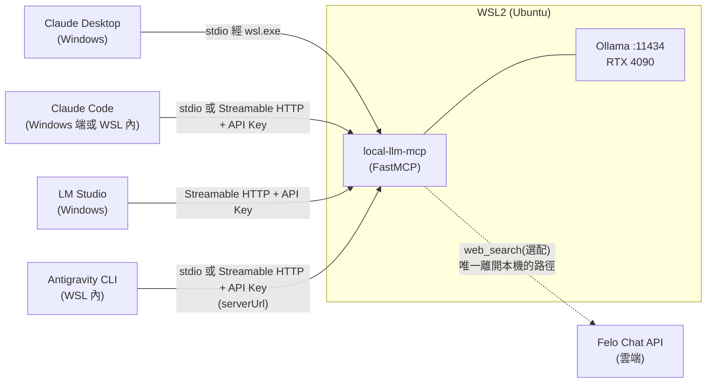
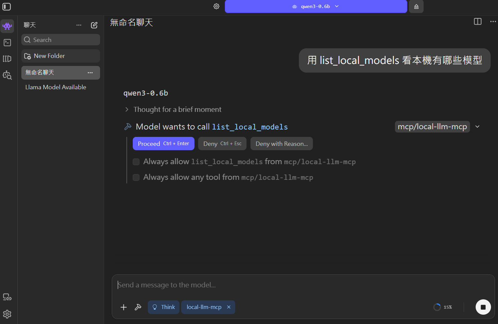

# local-llm-mcp


<!-- TODO(publish): 上 GitHub 後把下面這行換成真實 repo 路徑並取消註解
[](https://github.com/<GITHUB_USER>/local-llm-mcp/actions/workflows/ci.yml)
-->

**一個生產等級的 MCP Server:讓 Claude Desktop、Claude Code、LM Studio、Antigravity CLI 等任何 MCP client,把摘要、翻譯、資訊抽取這類敏感任務委派給本機 Ollama 上的開源模型執行 —— 文件內容全程留在本機,不經過雲端 LLM。**

完整實作 MCP 的三大 primitive(Tools / Resources / Prompts)、雙 transport(stdio / Streamable HTTP)、官方機制的 API Key 驗證,並實測橫跨四個真實 MCP client。過程中挖出並修正了兩個此前無人記錄的問題 —— 詳見下方「核心賣點」。

---

## 目錄

- [架構](#架構)
- [核心賣點](#核心賣點)
- [功能](#功能)
- [系統需求](#系統需求)
- [安裝與快速開始](#安裝與快速開始)
- [Client 安裝教學](#client-安裝教學)
- [相容性矩陣](#相容性矩陣)
- [延遲量測摘要](#延遲量測摘要)
- [Demo](#demo)
- [授權](#授權)

---

## 架構



Server 與 Ollama 都跑在 WSL2 內;四個 client 分別以自己最合適的方式連進來,**兩種 transport 都要做,不是因為每個 client 都要兩種都測,而是因為不同 client 需要不同 transport**:

- **Claude Desktop** 的 custom connector 連線從 Anthropic 雲端發起,不是本機 —— Streamable HTTP 對它沒用,**只能走 stdio**(經 `wsl.exe`)
- **Claude Code / LM Studio / Antigravity CLI** 都是本機直連的 client,原生支援 Streamable HTTP + 自訂 header,用來示範 API Key 驗證的 HTTP 路徑
- LM Studio 在 Windows 原生執行,靠 WSL2 NAT 模式預設開啟的 localhost forwarding 連到 WSL 內的 server,不需要修改 `.wslconfig`

---

## 核心賣點

1. **完整的 MCP 三大 primitive + 雙 transport + 官方驗證機制** —— 7 個 tools(6 個純本機 + 1 個選配的雲端搜尋,構成混合隱私分流)、1 個 resource、2 個 prompt,stdio 與 Streamable HTTP 都實作,HTTP 驗證用官方 `TokenVerifier` + `AuthSettings` 機制(而非自製 middleware),不是最小可行的 tool-only demo。
2. **實測橫跨四個真實 MCP client**,涵蓋 Windows 原生程序呼叫 WSL2 內服務的跨邊界網路與程序模型細節(WSL2 NAT localhost forwarding、`wsl.exe` 程序模型、環境變數不會跨界傳遞等),不是紙上談兵的相容性宣稱。
3. **兩個靠實測挖出來的深層問題,其中一個的歸因後來被自己推翻**:
   - 官方 MCP Python SDK v1.x 的 `Context.report_progress()` 沒有設定 `related_request_id`,導致 Streamable HTTP 下進度通知被路由到錯誤的 stream(讀 SDK 原始碼定位,並對照同一個檔案裡確實有帶上這個欄位的 `Context.log()`,證明是遺漏而非設計如此)。實作了一個 workaround helper,並用官方 client SDK 的 `progress_callback` 實測驗證 —— stdio 與 Streamable HTTP 下都收到 4 筆與 Ollama 回報位元組數精確對應的進度通知。回頭複查上游(2026-07-25)發現維護者已於 2026-06-26 以 PR #2994 把修正補進 `v1.x` 分支,但那次 merge 比 1.28.1 上架 PyPI 晚約 46 分鐘、剛好錯過,至今沒有任何已發行的 1.x 含這個修正(最新仍是 1.28.1),因此在本專案 pin 的 `>=1.28.1,<2.0` 範圍內 workaround 仍然必要,待下一個 1.x release 後即可移除。
   - stdio 啟動時,pipe 生命週期中**第一次寫入**的開頭會出現 3 bytes 的 UTF-8 BOM,而 MCP 的第一個訊息永遠是 `initialize` request,這個 BOM 會讓 JSON parser 直接失敗。這是用 Node.js `child_process.spawn` 逐 byte 比對才量到的(送出 11 bytes、收到 14 bytes),當時歸因為 `wsl.exe` 的缺陷。**2026-07-25 為了回報上游而重新設計對照實驗,推翻了這個歸因** —— BOM 來自 Windows PowerShell 5.1 在 code page 65001 下的文字模式管線(關鍵對照組:路徑裡完全沒有 `wsl.exe` 時同樣出現 BOM,改由 `cmd.exe` 處理管線則乾淨),`wsl.exe` 本身逐 byte 乾淨,原本的 `sed` workaround 也證實不必要。觸發條件收斂到 `chcp 65001` 有、`chcp 437` 沒有;機制是 PS 5.1 依 console code page 建立的文字模式 pipeline writer 會寫出該編碼的 preamble,而 `StreamWriter` 的 preamble 只寫一次——正好解釋「只有第一次寫入」。Claude Desktop 當初連不上的真正原因仍未定案。
4. **對「本地模型處理不可信文件」的 prompt injection 風險有具體分析與緩解設計**:輸出一律視為資料而非指令(host 端不應自動執行摘要/翻譯結果中的指令)、輸出長度上限、不做工具鏈自動串接;也記錄了若日後要把 Streamable HTTP 公開曝露(如透過 cloudflared tunnel)所需的縱深防禦考量。

---

## 功能

### Tools

| 工具 | 說明 |
|---|---|
| `ask_local` | 自由問答,直接把 prompt 丟給本機模型 |
| `summarize_private` | 摘要私密文字;超過安全字數門檻會自動依段落/句子邊界切成多個 chunk,map-reduce 方式逐段摘要後再合併,並回報處理進度 |
| `translate_private` | 中英互譯(`target_lang: "zh-TW" \| "en"`),來源語言由模型自動判斷 |
| `extract_json` | 依呼叫端在執行期提供的任意 JSON Schema 抽取結構化資料,溫度固定為 0(用 Ollama 的 `format=` 結構化輸出,而非 SDK 靜態 `outputSchema` 推導) |
| `list_local_models` | 列出本機所有 Ollama 模型(`parameter_size`、`quantization_level`、`family`、`context_length`) |
| `pull_model` | 下載 Ollama 模型,透過 MCP progress 通知回報下載進度 |
| `web_search`(選配) | **唯一刻意離開本機的工具**:透過 Felo Chat API 做即時網路搜尋,回傳附引用來源的答案。工具描述明確標注隱私邊界,讓呼叫端 LLM 能正確分流——敏感內容走 `*_private` 工具(全程本機),公開知識查詢走 `web_search`(雲端)。未設定 `FELO_API_KEY` 時回傳結構化錯誤,其餘工具不受影響 |

### Resource

| Resource | 說明 |
|---|---|
| `models://local` | 本機模型清單的快照 —— 與 `list_local_models` 共用同一份底層邏輯,但走「GET 目前狀態」的 Resource 語意,而非「執行動作」的 Tool 語意 |

### Prompts

| Prompt | 說明 |
|---|---|
| `summarize_for_report` | 把文字包裝成「請摘要成適合放進正式報告的語氣」的指令模板 |
| `translate_formal` | 把文字包裝成「請用正式書面語互譯中英文」的指令模板 |

---

## 系統需求

- Windows 11 + WSL2(開發與實測環境的發行版為 Ubuntu;server 與 Ollama 都跑在 WSL2 內)
- NVIDIA GPU,支援 WSL2 GPU passthrough(開發與延遲量測環境為 RTX 4090 24GB)
- Python 3.11+(開發環境實測為 3.12.3)
- [Ollama](https://ollama.com)(server 端跑在 WSL2 內,見下方安裝說明)
- [uv](https://docs.astral.sh/uv/)(建議;也提供 `requirements.txt` 給不用 uv 的使用者)

---

## 安裝與快速開始

### 1. 在 WSL2 內安裝 Ollama

若有 sudo 權限,直接用官方安裝腳本:

```bash
curl -fsSL https://ollama.com/install.sh | sh
```

**若沒有 sudo 密碼**,可用 user-space tarball 安裝法(本專案實測環境即為此情境):

```bash
# 先用官方 API 確認目前最新版的實際 asset 檔名/格式 —— 這個格式短短兩天內
# 就從 .tgz 改成 .tar.zst,不要照抄任何寫死版本號的指令
curl -s https://api.github.com/repos/ollama/ollama/releases/latest

curl -sL https://github.com/ollama/ollama/releases/download/<version>/ollama-linux-amd64.tar.zst \
  -o ~/downloads/ollama.tar.zst
mkdir -p ~/ollama-local
tar --zstd -xf ~/downloads/ollama.tar.zst -C ~/ollama-local

nohup ~/ollama-local/bin/ollama serve > ~/ollama-local/run/serve.log 2>&1 < /dev/null &
disown
```

GPU(CUDA)偵測不需要額外設定,WSL2 的 GPU passthrough 對 `ollama serve` 是透明的。

拉取預設模型(TAIDE,台灣在地化的 Llama3 8B 微調):

```bash
ollama pull cwchang/llama3-taide-lx-8b-chat-alpha1
```

### 2. 安裝 local-llm-mcp

```bash
git clone <this-repo>
cd local-llm-mcp
uv sync
cp .env.example .env   # 依需求編輯,詳見下方環境變數表
```

啟動(stdio,預設):

```bash
uv run local-llm-mcp
```

啟動 Streamable HTTP(需先在 `.env` 設定 `LOCAL_LLM_MCP_API_KEY`,未設定會 fail-fast 拒絕啟動):

```bash
uv run local-llm-mcp --transport streamable-http
```

專案發布到 GitHub 後,也可以不 clone、直接一行啟動:

```bash
uvx --from git+https://github.com/<owner>/local-llm-mcp local-llm-mcp
```

### 環境變數

完整內容見 [`.env.example`](./.env.example),重點如下:

| 變數 | 預設值 | 說明 |
|---|---|---|
| `OLLAMA_HOST` | `http://127.0.0.1:11434` | Ollama server 位址 |
| `LOCAL_LLM_MCP_DEFAULT_MODEL` | `cwchang/llama3-taide-lx-8b-chat-alpha1` | 未指定 `model` 參數時使用的預設模型 |
| `LOCAL_LLM_MCP_CONNECT_TIMEOUT` | `5` | httpx 連線逾時(秒)—— Ollama 官方 client 預設永不逾時,必須自己設定 |
| `LOCAL_LLM_MCP_READ_TIMEOUT` | `300` | httpx 讀取逾時(秒) |
| `LOCAL_LLM_MCP_MAX_PROMPT_CHARS` | `8000` | `ask_local` / `translate_private` / `extract_json` 的輸入長度上限 |
| `LOCAL_LLM_MCP_MAX_SUMMARIZE_CHARS` | `200000` | `summarize_private` 的輸入長度上限 |
| `LOCAL_LLM_MCP_NUM_CTX` | `8192` | 每次請求明確帶入的 context window —— Ollama 官方文件對預設值的說法互相矛盾,不可信任,一律明確指定 |
| `LOCAL_LLM_MCP_TRANSPORT` | `stdio` | 預設 transport,可被 CLI 的 `--transport` 覆寫 |
| `LOCAL_LLM_MCP_HTTP_HOST` / `_PORT` / `_PATH` | `127.0.0.1` / `8000` / `/mcp` | Streamable HTTP 綁定位址、埠、路徑 |
| `LOCAL_LLM_MCP_API_KEY` | (未設定) | Streamable HTTP 的 Bearer token,**必填**才能啟動 HTTP transport;可用 `python -c "import secrets; print(secrets.token_urlsafe(32))"` 產生 |
| `LOCAL_LLM_MCP_EXTRA_ALLOWED_HOSTS` | (未設定) | 逗號分隔的額外可信 Host header / Origin,只在把 server 放到 tunnel 後方時才需要;**只放寬 Host header 檢查,不改變綁定位址**(仍是 `127.0.0.1`) |

**最後那個變數為什麼存在,以及使用前該知道的事**:綁定 `127.0.0.1` 會讓 SDK 自動開啟 DNS-rebinding 保護,任何非 localhost 的 Host header 一律回 `421 Invalid Host header`。把 server 放在 tunnel(例如 cloudflared)後方時,即使 tunnel 實際連的是 localhost,轉發進來的 Host header 仍然是 tunnel 的網域,因此會被擋掉——這個變數就是為這種情況準備的,而且它只加寬 Host header 的白名單,綁定位址不變。

但本專案的預設與唯一受支援組態仍然是「只綁 `127.0.0.1`、不對外曝露」。真的要曝露之前,至少要先知道三件事:

1. `LOCAL_LLM_MCP_API_KEY` 是唯一的驗證機制,沒有 rate limit、沒有 IP 白名單。key 一旦洩漏,等於這台機器上的本地模型任人使用。
2. cloudflared quick tunnel 官方文件明講**不支援 SSE**,而 Streamable HTTP 的通知流(包含 `pull_model` 的進度通知)依賴 SSE —— 走 quick tunnel 會讓進度通知失效。
3. `trycloudflare.com` 這個網域常被資安工具標記(SigmaHQ 有對應偵測規則),企業網路或 EDR 環境可能直接封鎖或告警。

---

## Client 安裝教學

### Claude Desktop(Windows,經 wsl.exe,stdio)

設定檔位置:`%APPDATA%\Claude\claude_desktop_config.json`。編輯後**必須完全關閉重開**(不是關視窗就好,工作管理員/系統匣層級)。

直接呼叫 WSL 內的 Python 解譯器即可,不需要額外包裝(2026-07-25 用 Node.js `spawn` 模擬 Claude Desktop 的啟動方式重測,`initialize` → `notifications/initialized` → `tools/list` 全部正常):

```jsonc
{
  "mcpServers": {
    "local-llm-mcp": {
      "command": "wsl.exe",
      "args": [
        "-d", "<你的 WSL 發行版名稱>",
        "--",
        "/home/<user>/local-llm-mcp/.venv/bin/python3", "-m", "local_llm_mcp.server"
      ]
    }
  }
}
```

> **關於本專案早期曾使用的 `sed` 過濾**:先前的設定在啟動指令外包了一層 `bash -c "sed -u '1s/^\xef\xbb\xbf//' | ..."`,用來剝除第一個訊息開頭出現的 UTF-8 BOM。後續的對照實驗證實那個 BOM 來自 Windows PowerShell 5.1 在 code page 65001 下的管線,**不是 `wsl.exe`**,因此經 Claude Desktop(Node `spawn`)啟動時並不需要這一層。若你的啟動路徑中確實有 PowerShell 介入而遇到同樣的解析失敗,再改用下面這個形式:
>
> ```jsonc
> "args": [
>   "-d", "<你的 WSL 發行版名稱>",
>   "--",
>   "bash", "-c",
>   "sed -u '1s/^\\xef\\xbb\\xbf//' | /home/<user>/local-llm-mcp/.venv/bin/python3 -m local_llm_mcp.server"
> ]
> ```
>
> 這個形式有兩個容易踩到的坑:(1)**`sed` 一定要加 `-u`(unbuffered)**——輸出不是終端機時 `sed` 預設會 block-buffer,JSON 那一行會卡在 buffer 裡送不出去,造成請求逾時;(2)**BOM pattern 必須包在單引號裡**——`1s/^\xef\xbb\xbf//` 若沒有額外包一層引號,bash 在 unquoted context 下會把 `\x` 解讀成「跳脫沒有特殊意義的字元」而直接吃掉反斜線,pattern 就整個失效。

另外,Claude Desktop 設定裡 `env` 區塊只作用在 Windows 端的 `wsl.exe` process,**不會**傳進 WSL 內的 server process;若要帶環境變數,改用 `bash -c "VAR=xxx exec ..."` 的內嵌寫法。專案路徑建議放在 WSL 的 ext4 檔案系統(`/home/...`)且避免空白字元,`--` 之後的路徑在某些情況下會被 WSL 端 shell 重新切開。

實測截圖(2026-07-17):


### Claude Code

Claude Code 對 stdio 與 HTTP 都原生支援良好,且因為它本身、server、Ollama 可以同時跑在同一個 WSL2 發行版內,兩種 transport 都跟原生 Linux 上一樣運作,沒有額外的 WSL 網路轉換問題。

在 **WSL 內**同時加入 stdio 與 HTTP 兩個版本:

```bash
# stdio
claude mcp add --transport stdio local-llm-mcp-stdio \
  -- /home/<user>/local-llm-mcp/.venv/bin/python -m local_llm_mcp.server

# Streamable HTTP + API Key
claude mcp add --transport http local-llm-mcp-http http://127.0.0.1:8000/mcp \
  --header "Authorization: Bearer <YOUR_API_KEY>"

claude mcp list
```

**Windows 端**已登入的 `claude` CLI,靠 WSL2 NAT 模式的 localhost forwarding,也可以直接測 HTTP 版本,不需要額外的網路設定:

```bash
claude mcp add --transport http local-llm-mcp http://127.0.0.1:8000/mcp \
  --header "Authorization: Bearer <YOUR_API_KEY>"
claude mcp list
claude -p "列出本機有哪些 Ollama 模型" --allowedTools mcp__local-llm-mcp__list_local_models
```

實測截圖(2026-07-17,WSL 內):


### LM Studio(Windows,Streamable HTTP)

設定檔位置:`%USERPROFILE%\.lmstudio\mcp.json`(也可在 App 內 Program 分頁 > Install > Edit mcp.json 直接編輯,存檔即自動載入)。

```jsonc
{
  "mcpServers": {
    "local-llm-mcp": {
      "url": "http://localhost:8000/mcp",
      "headers": {
        "Authorization": "Bearer <YOUR_API_KEY>"
      }
    }
  }
}
```

WSL2 NAT 模式(預設)下,Windows → WSL2 的 localhost forwarding 是內建開啟的,不需要修改 `.wslconfig` 或啟用 mirrored networking。啟用後在對話輸入區的扳手圖示可以看到「Integrations」面板列出 `mcp/local-llm-mcp`,呼叫工具時會跳出官方的確認對話框(Proceed / Deny / Deny with Reason)。

**已知限制**:LM Studio 目前只支援 MCP 的 Tools primitive,Integrations 面板不會顯示 Resources 或 Prompts。

**實測時發現的使用陷阱**(2026-07-17,qwen3-0.6b):如果對話歷史裡已經有一次工具呼叫的結果,小模型對同樣的問題**可能直接從歷史抄答案而不再真的呼叫工具**(回覆裡不會出現工具標籤,且內容可能過時或不完整)。要驗證工具鏈是否真的可用,務必開一個乾淨的新對話再測。

實測截圖(2026-07-17):





### Antigravity CLI(WSL 內)—— 取代已停役的 Gemini CLI

> **⚠️ 生態變動紀錄**:Google 已於 **2026-06-18 對個人用戶停用 Gemini CLI**(免費/AI Pro/Ultra 全數停服,僅 Gemini Code Assist 企業版存續),接替者是閉源 Go 重寫的 **Antigravity CLI**。本專案在停用前(2026-07-15)完成過 Gemini CLI 的連線層驗證(`gemini mcp list` 兩個 transport 皆 Connected —— 該健康檢查為純本地操作,不受停服影響),當時的兩個設定要點留作歷史紀錄:Streamable HTTP 要用 `httpUrl` 欄位(不是 `url`)、伺服器名稱不能包含底線。真實工具呼叫的驗證則改在 Antigravity CLI 上完成(見下)。

安裝:`curl -fsSL https://antigravity.google/cli/install.sh | bash`(裝到 `~/.local/bin/agy`)。

MCP 設定檔位置:`~/.gemini/config/mcp_config.json`(Antigravity CLI 與 Antigravity IDE 共用)。**與 Gemini CLI 的差異**:Streamable HTTP 改用 `serverUrl` 欄位(不是 `httpUrl`);設定檔不支援環境變數展開,API Key 需寫入實際值。

```jsonc
{
  "mcpServers": {
    "local-llm-mcp-stdio": {
      "command": "/home/<user>/local-llm-mcp/.venv/bin/local-llm-mcp",
      "args": []
    },
    "local-llm-mcp-http": {
      "serverUrl": "http://localhost:8000/mcp",
      "headers": {
        "Authorization": "Bearer <YOUR_API_KEY>"
      }
    }
  }
}
```

啟動 `agy` 完成 Google OAuth 後,輸入 `/mcp` 可看到兩個 server 與全部 7 個工具。實測(2026-07-17,v1.1.3):


---

## 相容性矩陣

實測結果:

| Client | 執行環境 | Transport | 連線驗證 | 真實工具呼叫 | Resources / Prompts | 備註 |
|---|---|---|---|---|---|---|
| Claude Desktop | Windows(config 指向 WSL) | stdio,經 `wsl.exe` | 已驗證(Node.js `spawn` 模擬完整 `initialize` 交握) | ✅ 已驗證(2026-07-17):Connectors 清單顯示 local-llm-mcp,真實呼叫 `list_local_models` 成功,見下方截圖 | 支援(SDK 層級) | 曾因第一個訊息開頭的 UTF-8 BOM 卡在 handshake,2026-07-25 對照實驗證實 BOM 來自 PowerShell 而非 `wsl.exe`;custom connector 為雲端 brokered,只能走 stdio |
| Claude Code(Windows) | Windows(既有已登入 CLI) | Streamable HTTP + API Key | `claude mcp list` 顯示 Connected | 已驗證:真實呼叫 `list_local_models`,正確生成模型表格 | 未測 | 端到端證明 Streamable HTTP + API Key 可用 |
| Claude Code(WSL) | WSL | stdio 與 HTTP+Key 皆測 | 兩者皆 Connected(各 7 tools) | ✅ 已驗證(2026-07-17):真實呼叫 `list_local_models` 成功,見下方截圖 | 未測 | 證實同環境內 stdio 沒有跨界問題(純 Linux pipe) |
| LM Studio | Windows | Streamable HTTP + API Key | Integrations 面板顯示已連線 | ✅ 已驗證(2026-07-15 初測,2026-07-17 重測並截圖):真實呼叫 `list_local_models`,含官方 Proceed/Deny 確認框,見下方截圖 | 僅 Tools,無 Resources / Prompts | 符合官方已知限制;NAT 模式 localhost forwarding 免改 `.wslconfig`;注意小模型會從對話歷史抄答案,驗證需開新對話 |
| Gemini CLI(已停役) | WSL | stdio 與 HTTP+Key(`httpUrl`)皆測 | `gemini mcp list` 兩者皆 Connected(2026-07-15,免登入) | 無法完成:Google 於 2026-06-18 對個人用戶停服 | — | 歷史紀錄:`httpUrl`(非 `url`)+ 連字號命名皆確認正確;由 Antigravity CLI 接替 |
| **Antigravity CLI** | WSL | stdio 與 HTTP+Key(`serverUrl`)皆設 | `/mcp` 面板兩者皆 ✓(各 7 tools) | ✅ 已驗證(2026-07-17,v1.1.3):經 **Streamable HTTP + API Key** 真實呼叫 `list_local_models` 成功,見下方截圖 | 未測 | Gemini CLI 的接替者(閉源 Go 重寫);設定檔改為 `~/.gemini/config/mcp_config.json`,HTTP 欄位改名 `serverUrl`,不支援環境變數展開 |
| Felo(選配) | 雲端 | SSE 或 Streamable HTTP(表單可選) | 已確認支援自訂 MCP server(2026-07-15 Pro 帳號實測:表單含服務名稱 / 連接模式 / URL / Header) | 未做(需先以 tunnel 曝露本機 server) | 未測 | 推翻「官方文件查無證據」的舊結論;端到端串接尚未實測 |

---

## 延遲量測摘要

模型組合:預設 `cwchang/llama3-taide-lx-8b-chat-alpha1`(8B,Q5_K_M)vs 對照組 `qwen2.5:3b`(3B,跨家族對照)。RTX 4090,WSL2,`num_ctx=8192`,每個模型跑之前先做一次未計時的 warmup 呼叫,單次量測(非多輪平均)。完整方法論與延遲量測腳本見 `scripts/bench_latency.py`。

| 工具 | 輸入 | TAIDE(8B) | qwen2.5:3b(3B) |
|---|---|---|---|
| `list_local_models` | — | 0.19s | — |
| `ask_local` | 短(~14 字) | 0.34s | 0.49s |
| `ask_local` | 長(~500 字) | 1.72s | 0.62s |
| `summarize_private` | 短文(單一 chunk) | 0.58s | 0.23s |
| `summarize_private` | 長文(1332 字,仍是單一 chunk) | 1.21s | 0.63s |
| `translate_private` | 一段落 | 0.56s | 0.25s |
| `extract_json` | 簡單 schema(1 欄位) | 0.37s | 0.27s |
| `extract_json` | 複雜 schema(5 欄位,含 enum) | 0.54s | 0.35s |

**觀察**:短輸入時兩個模型的延遲接近,固定開銷(HTTP round-trip、tokenize)蓋過模型大小差異;輸入變長、任務變複雜後,小模型的速度優勢才明顯浮現。

---

## Demo

`docs/demo.gif`(demo GIF 待補)

---

## 授權

MIT — 詳見 [`LICENSE`](./LICENSE)。
