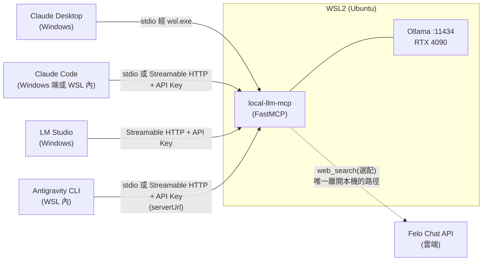

# local-llm-mcp


[](https://github.com/kuotunyu/local-llm-mcp/actions/workflows/ci.yml)

**把摘要、翻譯、資訊抽取這類敏感任務,委派給本機 Ollama 上的開源模型 —— 文件內容不離開這台機器。**

任何 MCP client 都能接,已實測四個:Claude Desktop、Claude Code、LM Studio、Antigravity CLI。

- MCP 三大 primitive 全做:7 個 tools、1 個 resource、2 個 prompts
- 雙 transport:stdio 與 Streamable HTTP,HTTP 用官方 `TokenVerifier` 做 API Key 驗證
- 每個 client 都有真實工具呼叫的截圖,不是相容性宣稱
- 兩個靠實測挖出來的深層問題,其中一個的歸因後來被自己推翻

---

## 目錄

- [架構](#架構)
- [核心賣點](#核心賣點)
- [功能](#功能)
- [系統需求](#系統需求)
- [安裝與快速開始](#安裝與快速開始)
- [Client 安裝教學](#client-安裝教學)
- [相容性矩陣](#相容性矩陣)
- [延遲量測摘要](#延遲量測摘要)
- [Demo](#demo)
- [授權](#授權)

---

## 架構



Server 與 Ollama 都跑在 WSL2 內。**兩種 transport 都做的原因是不同 client 只能走不同 transport**,不是為了湊數:

- **Claude Desktop** 的 custom connector 從 Anthropic 雲端發起連線 —— Streamable HTTP 對它沒用,只能走 stdio(經 `wsl.exe`)
- **Claude Code / LM Studio / Antigravity CLI** 都是本機直連,支援 Streamable HTTP + 自訂 header,用來示範 API Key 驗證
- LM Studio 跑在 Windows 原生,靠 WSL2 NAT 預設開啟的 localhost forwarding 連進 WSL,不必改 `.wslconfig`

---

## 核心賣點

**完整度,不是最小可行 demo**

7 個 tools(6 個純本機 + 1 個選配的雲端搜尋,構成混合隱私分流)、1 個 resource、2 個 prompts。stdio 與 Streamable HTTP 都實作,HTTP 驗證走官方 `TokenVerifier` + `AuthSettings`,不是自製 middleware。

**四個真實 client 實測**

涵蓋 Windows 原生程序呼叫 WSL2 內服務的細節:NAT localhost forwarding、`wsl.exe` 程序模型、環境變數不會跨界傳遞。
**SDK 的 progress 路由缺陷**

官方 MCP Python SDK v1.x 的 `Context.report_progress()` 沒帶 `related_request_id`,Streamable HTTP 下進度通知會被路由到錯的 stream。判斷依據是同一個檔案裡的 `Context.log()` **有**帶 —— 是遺漏,不是設計。

本專案用一個 helper 繞過,並以官方 client SDK 的 `progress_callback` 實測:stdio 與 HTTP 下都收到 4 筆與 Ollama 回報位元組數精確對應的通知。

上游其實已經修了,但還沒發行:PR #2994 於 2026-06-26 進 `v1.x` 分支,那次 merge 比 1.28.1 上架 PyPI 晚約 46 分鐘、剛好錯過。至今沒有任何已發行的 1.x 含這個修正,所以在本專案 pin 的 `>=1.28.1,<2.0` 範圍內 workaround 仍然必要。

**一個被自己推翻的歸因**

stdio 第一次寫入的開頭會多出 3 bytes 的 UTF-8 BOM,而 MCP 的第一個訊息永遠是 `initialize`,BOM 讓 JSON parser 直接失敗。用 Node.js `child_process.spawn` 逐 byte 比對量到:送出 11 bytes、收到 14 bytes。當時歸因為 `wsl.exe` 的缺陷。

2026-07-25 為了回報上游而重做對照實驗,推翻了這個結論:**BOM 來自 Windows PowerShell 5.1 在 code page 65001 下的文字模式管線,與 `wsl.exe` 無關。**

- 關鍵對照組:把 `wsl.exe` 從路徑裡完全移除 —— BOM 照樣出現;同一條管線改由 `cmd.exe` 處理則乾淨
- 機制:`StreamWriter` 的 preamble 一輩子只寫一次,正好解釋「只有第一次寫入」這個特徵
- 結果:原本的 `sed` workaround 證實不必要;Claude Desktop 當初連不上的真正原因仍未定案

**prompt injection 的緩解設計**

輸出一律視為資料而非指令(host 端不該自動執行摘要結果裡的指令)、輸入長度上限、不做工具鏈自動串接。

---

## 功能

### Tools

| 工具 | 說明 |
|---|---|
| `ask_local` | 自由問答,直接把 prompt 丟給本機模型 |
| `summarize_private` | 摘要私密文字。超過門檻會依段落/句子邊界切 chunk,map-reduce 逐段摘要後合併,並回報進度 |
| `translate_private` | 中英互譯(`target_lang: "zh-TW" \| "en"`),來源語言由模型自動判斷 |
| `extract_json` | 依呼叫端在執行期給的任意 JSON Schema 抽取結構化資料,溫度固定 0(走 Ollama 的 `format=`,不是 SDK 的靜態 `outputSchema`) |
| `list_local_models` | 列出本機 Ollama 模型(`parameter_size`、`quantization_level`、`family`、`context_length`) |
| `pull_model` | 下載 Ollama 模型,以 MCP progress 通知回報進度 |
| `web_search`(選配) | **唯一刻意離開本機的工具**:經 Felo Chat API 做即時搜尋,回傳附引用的答案。工具描述明確標注隱私邊界,讓呼叫端 LLM 能分流 —— 敏感內容走 `*_private`,公開知識走 `web_search`。未設 `FELO_API_KEY` 時回傳結構化錯誤,不影響其餘工具 |

### Resource

| Resource | 說明 |
|---|---|
| `models://local` | 本機模型清單的快照。與 `list_local_models` 共用底層邏輯,但走「GET 目前狀態」的 Resource 語意,而非「執行動作」的 Tool 語意 |

### Prompts

| Prompt | 說明 |
|---|---|
| `summarize_for_report` | 把文字包裝成「請摘要成適合放進正式報告的語氣」的指令模板 |
| `translate_formal` | 把文字包裝成「請用正式書面語互譯中英文」的指令模板 |

---

## 系統需求

- Windows 11 + WSL2(開發與實測環境的發行版為 Ubuntu;server 與 Ollama 都跑在 WSL2 內)
- NVIDIA GPU,支援 WSL2 GPU passthrough(開發與延遲量測環境為 RTX 4090 24GB)
- Python 3.11+(開發環境實測為 3.12.3)
- [Ollama](https://ollama.com)(server 端跑在 WSL2 內,見下方安裝說明)
- [uv](https://docs.astral.sh/uv/)(建議;也提供 `requirements.txt` 給不用 uv 的使用者)

---

## 安裝與快速開始

### 1. 在 WSL2 內安裝 Ollama

若有 sudo 權限,直接用官方安裝腳本:

```bash
curl -fsSL https://ollama.com/install.sh | sh
```

**若沒有 sudo 密碼**,可用 user-space tarball 安裝法(本專案實測環境即為此情境):

```bash
# 先用官方 API 確認目前最新版的實際 asset 檔名/格式 —— 這個格式短短兩天內
# 就從 .tgz 改成 .tar.zst,不要照抄任何寫死版本號的指令
curl -s https://api.github.com/repos/ollama/ollama/releases/latest

curl -sL https://github.com/ollama/ollama/releases/download/<version>/ollama-linux-amd64.tar.zst \
  -o ~/downloads/ollama.tar.zst
mkdir -p ~/ollama-local
tar --zstd -xf ~/downloads/ollama.tar.zst -C ~/ollama-local

nohup ~/ollama-local/bin/ollama serve > ~/ollama-local/run/serve.log 2>&1 < /dev/null &
disown
```

GPU(CUDA)偵測不需要額外設定,WSL2 的 GPU passthrough 對 `ollama serve` 是透明的。

拉取預設模型(TAIDE,台灣在地化的 Llama3 8B 微調):

```bash
ollama pull cwchang/llama3-taide-lx-8b-chat-alpha1
```

### 2. 安裝 local-llm-mcp

```bash
git clone <this-repo>
cd local-llm-mcp
uv sync
cp .env.example .env   # 依需求編輯,詳見下方環境變數表
```

啟動(stdio,預設):

```bash
uv run local-llm-mcp
```

啟動 Streamable HTTP(需先在 `.env` 設定 `LOCAL_LLM_MCP_API_KEY`,未設定會 fail-fast 拒絕啟動):

```bash
uv run local-llm-mcp --transport streamable-http
```

專案發布到 GitHub 後,也可以不 clone、直接一行啟動:

```bash
uvx --from git+https://github.com/kuotunyu/local-llm-mcp local-llm-mcp
```

### 環境變數

完整內容見 [`.env.example`](./.env.example),重點如下:

| 變數 | 預設值 | 說明 |
|---|---|---|
| `OLLAMA_HOST` | `http://127.0.0.1:11434` | Ollama server 位址 |
| `LOCAL_LLM_MCP_DEFAULT_MODEL` | `cwchang/llama3-taide-lx-8b-chat-alpha1` | 未指定 `model` 參數時使用的預設模型 |
| `LOCAL_LLM_MCP_CONNECT_TIMEOUT` | `5` | httpx 連線逾時(秒)—— Ollama 官方 client 預設永不逾時,必須自己設定 |
| `LOCAL_LLM_MCP_READ_TIMEOUT` | `300` | httpx 讀取逾時(秒) |
| `LOCAL_LLM_MCP_MAX_PROMPT_CHARS` | `8000` | `ask_local` / `translate_private` / `extract_json` 的輸入長度上限 |
| `LOCAL_LLM_MCP_MAX_SUMMARIZE_CHARS` | `200000` | `summarize_private` 的輸入長度上限 |
| `LOCAL_LLM_MCP_NUM_CTX` | `8192` | 每次請求明確帶入的 context window —— Ollama 官方文件對預設值的說法互相矛盾,不可信任,一律明確指定 |
| `LOCAL_LLM_MCP_TRANSPORT` | `stdio` | 預設 transport,可被 CLI 的 `--transport` 覆寫 |
| `LOCAL_LLM_MCP_HTTP_HOST` / `_PORT` / `_PATH` | `127.0.0.1` / `8000` / `/mcp` | Streamable HTTP 綁定位址、埠、路徑 |
| `LOCAL_LLM_MCP_API_KEY` | (未設定) | Streamable HTTP 的 Bearer token,**必填**才能啟動 HTTP transport;可用 `python -c "import secrets; print(secrets.token_urlsafe(32))"` 產生 |
| `LOCAL_LLM_MCP_EXTRA_ALLOWED_HOSTS` | (未設定) | 逗號分隔的額外可信 Host header / Origin,只在把 server 放到 tunnel 後方時才需要;**只放寬 Host header 檢查,不改變綁定位址**(仍是 `127.0.0.1`) |

最後那個變數的用途:綁定 `127.0.0.1` 會讓 SDK 自動開啟 DNS-rebinding 保護,任何非 localhost 的 Host header 一律回 `421 Invalid Host header`。放在 tunnel 後方時,轉發進來的 Host 是 tunnel 的網域,因此會被擋 —— 這個變數就是為此準備的,而且它只加寬 Host header 白名單,綁定位址不變。

> **但預設與唯一受支援的組態仍然是「只綁 `127.0.0.1`、不對外曝露」。** 要曝露之前先知道三件事:API Key 是唯一的驗證機制,沒有 rate limit 也沒有 IP 白名單,洩漏等於本地模型任人使用;cloudflared quick tunnel 官方明講不支援 SSE,`pull_model` 的進度通知會失效;`trycloudflare.com` 常被資安工具標記(SigmaHQ 有偵測規則),企業網路或 EDR 可能直接封鎖。

---

## Client 安裝教學

### Claude Desktop(Windows,經 wsl.exe,stdio)

設定檔位置:`%APPDATA%\Claude\claude_desktop_config.json`。編輯後**必須完全關閉重開**(不是關視窗就好,工作管理員/系統匣層級)。

直接呼叫 WSL 內的 Python 解譯器即可,不需要額外包裝(2026-07-25 用 Node.js `spawn` 模擬 Claude Desktop 的啟動方式重測,`initialize` → `notifications/initialized` → `tools/list` 全部正常):

```jsonc
{
  "mcpServers": {
    "local-llm-mcp": {
      "command": "wsl.exe",
      "args": [
        "-d", "<你的 WSL 發行版名稱>",
        "--",
        "/home/<user>/local-llm-mcp/.venv/bin/python3", "-m", "local_llm_mcp.server"
      ]
    }
  }
}
```

兩個 WSL 特有的注意事項:

- 設定裡的 `env` 區塊只作用在 Windows 端的 `wsl.exe` process,**不會**傳進 WSL 內的 server —— 要帶環境變數請用 `bash -c "VAR=xxx exec ..."`
- `--` 之後的路徑在某些情況下會被 WSL 端 shell 重新切開,專案路徑請避免空白字元

> **早期版本曾包一層 `sed`**
>
> 先前的設定用 `bash -c "sed -u '1s/^\xef\xbb\xbf//' | ..."` 剝除第一個訊息開頭的 UTF-8 BOM。對照實驗證實那個 BOM 來自 PowerShell 而非 `wsl.exe`,所以經 Claude Desktop(Node `spawn`)啟動並不需要這一層。
>
> 若你的啟動路徑真的有 PowerShell 介入、遇到同樣的解析失敗,把 `args` 換成:
>
> ```jsonc
> ["-d", "<發行版>", "--", "bash", "-c",
>  "sed -u '1s/^\\xef\\xbb\\xbf//' | <venv python> -m local_llm_mcp.server"]
> ```
>
> 這個形式有兩個坑:`sed` 一定要加 `-u`(否則 block-buffer 會把 JSON 卡在 buffer 裡),pattern 一定要包在單引號裡(否則 bash 會吃掉反斜線讓 pattern 失效)。

實測截圖(2026-07-17):


### Claude Code

Claude Code、server、Ollama 可以同時跑在同一個 WSL2 發行版內,所以兩種 transport 都跟原生 Linux 一樣運作,沒有跨界轉換問題。

在 **WSL 內**同時加入 stdio 與 HTTP 兩個版本:

```bash
# stdio
claude mcp add --transport stdio local-llm-mcp-stdio \
  -- /home/<user>/local-llm-mcp/.venv/bin/python -m local_llm_mcp.server

# Streamable HTTP + API Key
claude mcp add --transport http local-llm-mcp-http http://127.0.0.1:8000/mcp \
  --header "Authorization: Bearer <YOUR_API_KEY>"

claude mcp list
```

**Windows 端**已登入的 `claude` CLI,靠 WSL2 NAT 模式的 localhost forwarding,也可以直接測 HTTP 版本,不需要額外的網路設定:

```bash
claude mcp add --transport http local-llm-mcp http://127.0.0.1:8000/mcp \
  --header "Authorization: Bearer <YOUR_API_KEY>"
claude mcp list
claude -p "列出本機有哪些 Ollama 模型" --allowedTools mcp__local-llm-mcp__list_local_models
```

實測截圖(2026-07-17,WSL 內):


### LM Studio(Windows,Streamable HTTP)

設定檔位置:`%USERPROFILE%\.lmstudio\mcp.json`(也可在 App 內 Program 分頁 > Install > Edit mcp.json 直接編輯,存檔即自動載入)。

```jsonc
{
  "mcpServers": {
    "local-llm-mcp": {
      "url": "http://localhost:8000/mcp",
      "headers": {
        "Authorization": "Bearer <YOUR_API_KEY>"
      }
    }
  }
}
```

WSL2 NAT 模式(預設)已內建 Windows → WSL2 的 localhost forwarding,不必改 `.wslconfig`,也不必啟用 mirrored networking。啟用後在輸入區的扳手圖示會看到「Integrations」面板列出 `mcp/local-llm-mcp`,呼叫工具時會跳出官方確認框。

- **已知限制**:LM Studio 目前只支援 Tools,Integrations 面板不會顯示 Resources 或 Prompts
- **使用陷阱**(2026-07-17,qwen3-0.6b):對話歷史裡若已有一次工具呼叫的結果,小模型可能直接抄歷史而不再真的呼叫工具 —— 驗證工具鏈務必開一個乾淨的新對話

實測截圖(2026-07-17):


### Antigravity CLI(WSL 內)—— 取代已停役的 Gemini CLI

> **⚠️ 生態變動**:Google 已於 **2026-06-18 對個人用戶停用 Gemini CLI**(僅 Gemini Code Assist 企業版存續),接替者是閉源 Go 重寫的 **Antigravity CLI**。
>
> 本專案在停用前(2026-07-15)完成過 Gemini CLI 的連線層驗證,兩個設定要點留作紀錄:Streamable HTTP 要用 `httpUrl`(不是 `url`)、server 名稱不能有底線。真實工具呼叫的驗證改在 Antigravity CLI 上完成。

安裝:`curl -fsSL https://antigravity.google/cli/install.sh | bash`(裝到 `~/.local/bin/agy`)。

MCP 設定檔位置:`~/.gemini/config/mcp_config.json`(Antigravity CLI 與 Antigravity IDE 共用)。**與 Gemini CLI 的差異**:Streamable HTTP 改用 `serverUrl` 欄位(不是 `httpUrl`);設定檔不支援環境變數展開,API Key 需寫入實際值。

```jsonc
{
  "mcpServers": {
    "local-llm-mcp-stdio": {
      "command": "/home/<user>/local-llm-mcp/.venv/bin/local-llm-mcp",
      "args": []
    },
    "local-llm-mcp-http": {
      "serverUrl": "http://localhost:8000/mcp",
      "headers": {
        "Authorization": "Bearer <YOUR_API_KEY>"
      }
    }
  }
}
```

啟動 `agy` 完成 Google OAuth 後,輸入 `/mcp` 可看到兩個 server 與全部 7 個工具。實測(2026-07-17,v1.1.3):


---

## 相容性矩陣

| Client | 執行環境 | Transport | 連線驗證 | 真實工具呼叫 | Resources / Prompts | 備註 |
|---|---|---|---|---|---|---|
| Claude Desktop | Windows(config 指向 WSL) | stdio,經 `wsl.exe` | Node.js `spawn` 模擬完整 `initialize` 交握 | ✅ 2026-07-17 | 支援(SDK 層級) | custom connector 是雲端 brokered,只能走 stdio。曾因第一個訊息的 BOM 卡在 handshake,已證實 BOM 來自 PowerShell 而非 `wsl.exe` |
| Claude Code(Windows) | Windows(既有已登入 CLI) | HTTP + API Key | `claude mcp list` Connected | ✅ 正確生成模型表格 | 未測 | 端到端證明 HTTP + API Key 可用 |
| Claude Code(WSL) | WSL | stdio 與 HTTP + Key 皆測 | 兩者皆 Connected(各 7 tools) | ✅ 2026-07-17 | 未測 | 同環境內 stdio 是純 Linux pipe,沒有跨界問題 |
| LM Studio | Windows | HTTP + API Key | Integrations 面板已連線 | ✅ 2026-07-15 初測、07-17 重測,含官方確認框 | 僅 Tools | NAT localhost forwarding 免改 `.wslconfig`;小模型會抄對話歷史,驗證需開新對話 |
| Gemini CLI(已停役) | WSL | stdio 與 HTTP + Key(`httpUrl`)皆測 | 2026-07-15 兩者皆 Connected | 無法完成:Google 於 2026-06-18 停服 | — | `httpUrl`(非 `url`)與連字號命名皆確認正確;由 Antigravity CLI 接替 |
| **Antigravity CLI** | WSL | stdio 與 HTTP + Key(`serverUrl`)皆設 | `/mcp` 兩者皆 ✓(各 7 tools) | ✅ 2026-07-17 v1.1.3,經 **HTTP + API Key** | 未測 | 設定檔 `~/.gemini/config/mcp_config.json`;HTTP 欄位改名 `serverUrl`;不支援環境變數展開 |
| Felo(選配) | 雲端 | SSE 或 Streamable HTTP | 2026-07-15 Pro 帳號確認支援自訂 MCP server | 未做(需先以 tunnel 曝露) | 未測 | 端到端串接尚未實測 |

每一列的 ✅ 都對應下方 Client 安裝教學裡的截圖。

---

## 延遲量測摘要

`cwchang/llama3-taide-lx-8b-chat-alpha1`(8B,Q5_K_M)對照 `qwen2.5:3b`(3B,跨家族)。RTX 4090 / WSL2 / `num_ctx=8192`,每個模型先跑一次未計時的 warmup,單次量測(非多輪平均)。腳本:`scripts/bench_latency.py`。

| 工具 | 輸入 | TAIDE(8B) | qwen2.5:3b(3B) |
|---|---|---|---|
| `list_local_models` | — | 0.19s | — |
| `ask_local` | 短(~14 字) | 0.34s | 0.49s |
| `ask_local` | 長(~500 字) | 1.72s | 0.62s |
| `summarize_private` | 短文(單一 chunk) | 0.58s | 0.23s |
| `summarize_private` | 長文(1332 字,仍是單一 chunk) | 1.21s | 0.63s |
| `translate_private` | 一段落 | 0.56s | 0.25s |
| `extract_json` | 簡單 schema(1 欄位) | 0.37s | 0.27s |
| `extract_json` | 複雜 schema(5 欄位,含 enum) | 0.54s | 0.35s |

**觀察**:短輸入時兩個模型的延遲接近,固定開銷(HTTP round-trip、tokenize)蓋過模型大小差異;輸入變長、任務變複雜後,小模型的速度優勢才明顯浮現。

---

## Demo

`docs/demo.gif`(demo GIF 待補)

---

## 授權

MIT — 詳見 [`LICENSE`](./LICENSE)。
