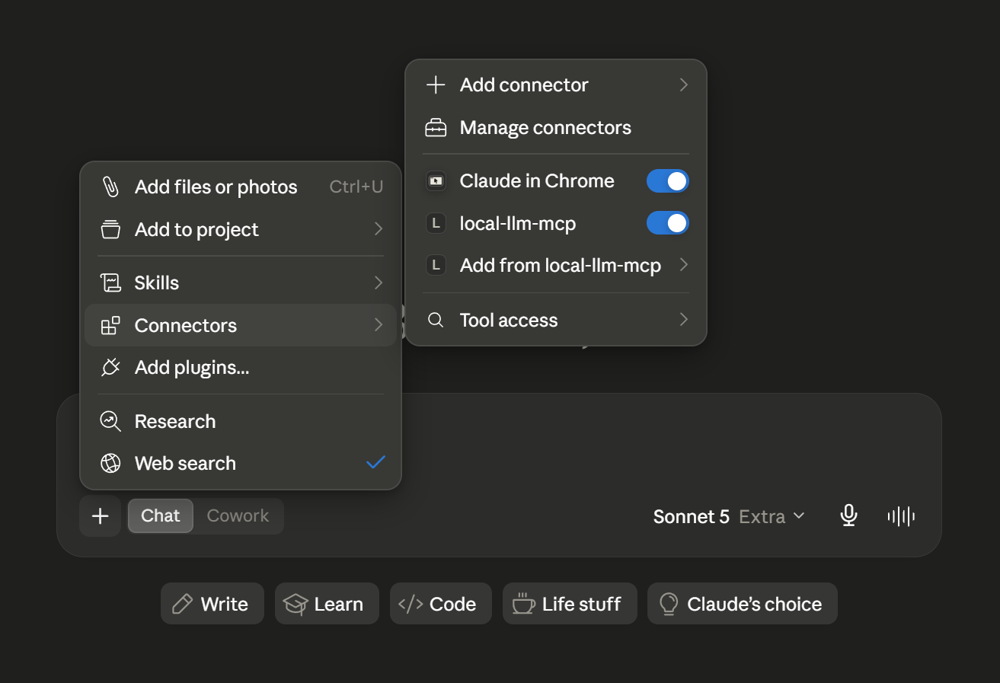
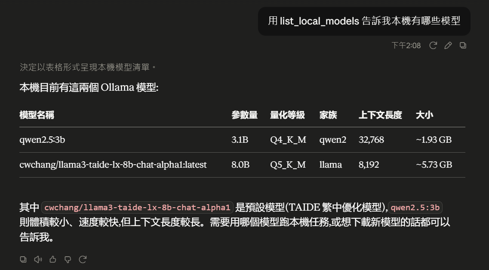
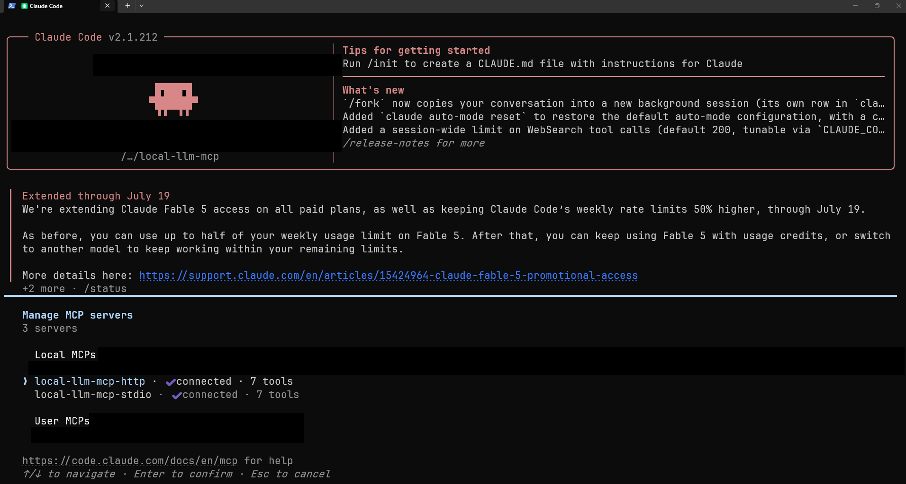
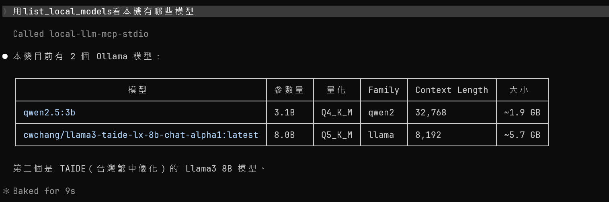
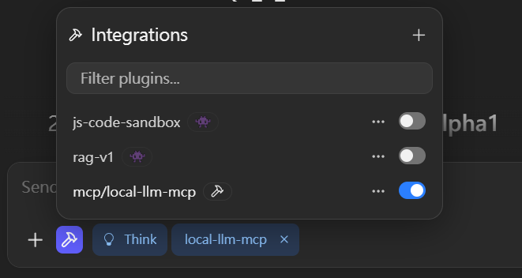
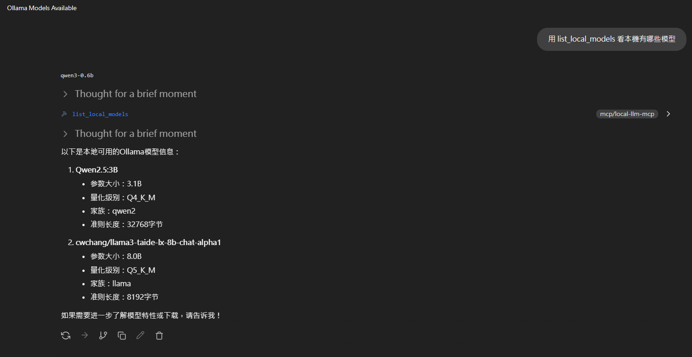
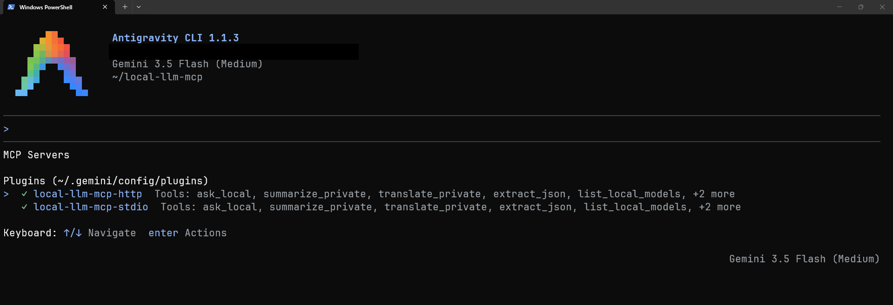
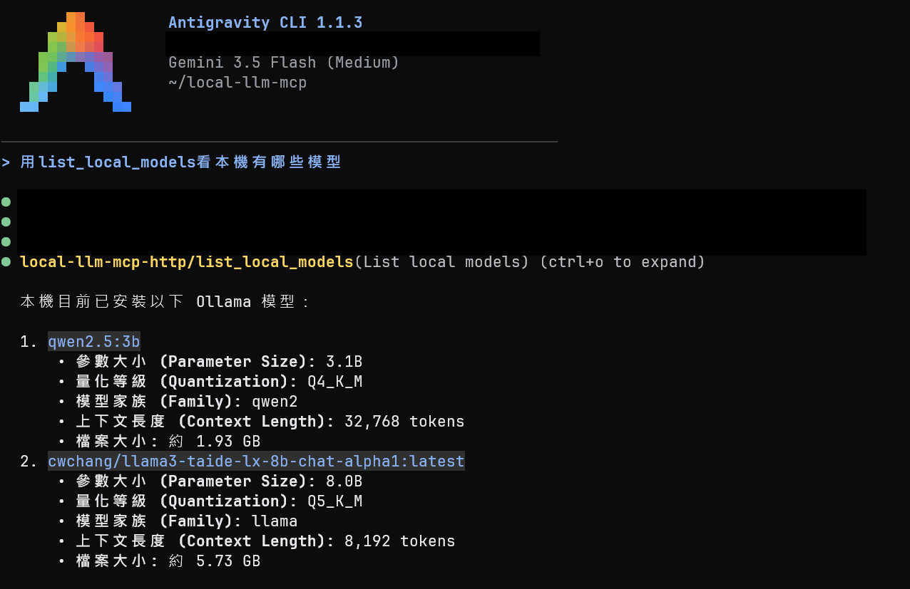
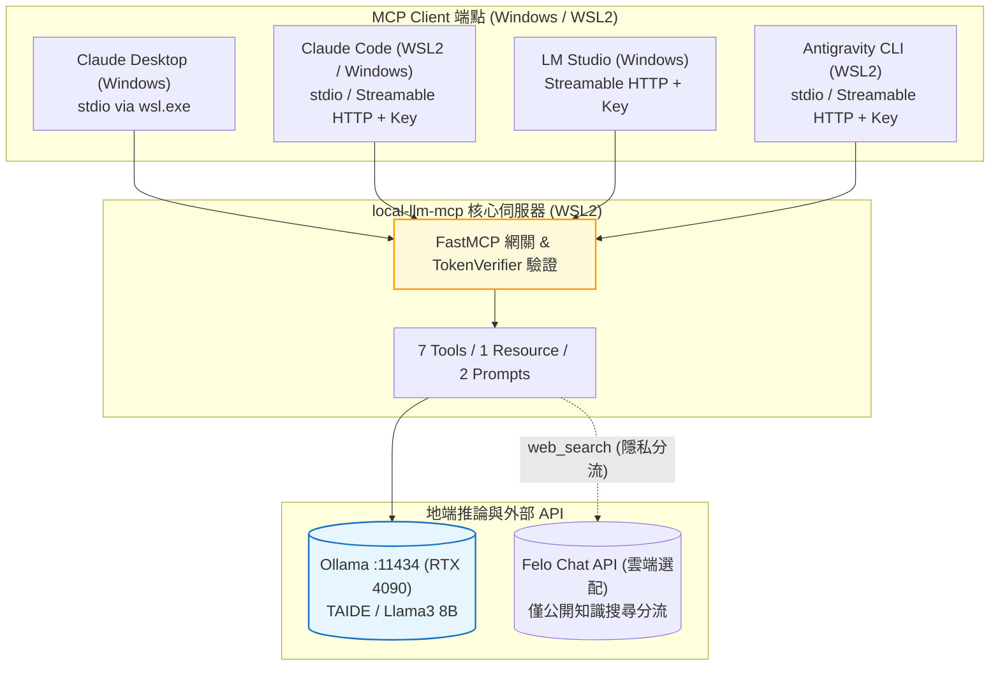
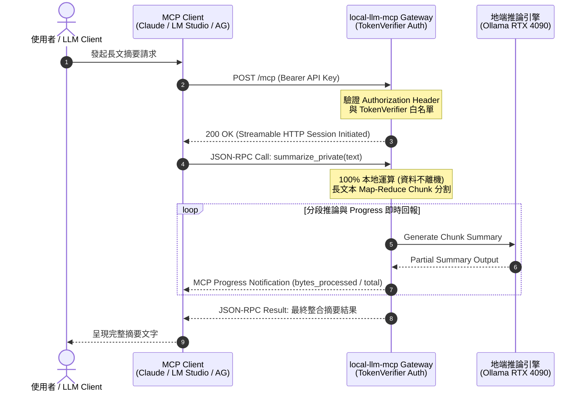

# local-llm-mcp

[](https://github.com/kuotunyu/local-llm-mcp/actions/workflows/ci.yml)


[](LICENSE)

本專案為遵循 Model Context Protocol (MCP) 規範實作之地端 LLM 隱私委派伺服器：將文件摘要、語言翻譯、結構化 JSON 抽取等高隱私需求任務，安全委派至本機 Ollama (如 TAIDE / Llama3 8B) 執行，確保敏感資料 100% 不離開本機。系統完整支援 stdio 與 Streamable HTTP 雙傳輸通道、HTTP Bearer API Key 驗證、MCP 進度回報 (Progress reporting) 與四款主流 Client 整合。

> **環境與相容性**：已完成 Claude Desktop、Claude Code、LM Studio 與 Antigravity CLI 四大 Client 之真實工具呼叫與相容性驗證。

---

## 系統介面與 Client 展示

### 1. Claude Desktop (Windows, stdio via wsl.exe)

| 連線狀態與 Connector 清單 | 工具呼叫實測 (Tool Call) |
|:---:|:---:|
|  |  |

### 2. Claude Code (WSL2 / Windows)

| 連線狀態與 Connector 清單 | 工具呼叫實測 (Tool Call) |
|:---:|:---:|
|  |  |

### 3. LM Studio (Windows, Streamable HTTP + Key)

| 連線狀態與 Connector 清單 | 工具呼叫實測 (Tool Call) |
|:---:|:---:|
|  |  |

### 4. Antigravity CLI (WSL2, Streamable HTTP + Key)

| 連線狀態與 Connector 清單 | 工具呼叫實測 (Tool Call) |
|:---:|:---:|
|  |  |

---

## 系統核心機制

1. **MCP 全功能 Primitive 覆蓋**：
   實作 7 個 Tools (6 純本機 + 1 雲端搜尋隱私分流)、1 個 Resource (`models://local`) 與 2 個 Prompts 範本。
2. **雙 Transport 通道與標準驗證**：
   支援傳統 `stdio` 通道，以及基於官方 `TokenVerifier` 與 `AuthSettings` 之 `Streamable HTTP` 通道，防止未授權存取。
3. **分段 Map-Reduce 摘要與 Progress 回報**：
   長文本摘要自動按段落/句子邊界切分 chunk，透過 map-reduce 進行逐段摘要與合併，並經由 MCP Stream 即時回報進度。
4. **Prompt Injection 防護與長度限制**：
   所有模型輸出硬性視為資料而非指令 (防止 Host 端自動執行)，並配置嚴格輸入長度限制與邊界隔離。

---

## 系統架構與通訊協定

### 1. 系統硬體與拓撲架構



### 2. MCP 傳輸協定與認證時序 (Protocol & Progress Sequence)



---

## 功能與工具規格

### 1. Tools 工具清單

| 工具名稱 | 類型 | 功能說明與參數規範 |
|---|---|---|
| `ask_local` | 純本機 | 自由問答，直接傳送 Prompt 給本機 Ollama 模型 |
| `summarize_private` | 純本機 | 支援長文本 Map-Reduce 分段摘要與 Progress 進度回報 |
| `translate_private` | 純本機 | 中英雙向自動判斷翻譯 (`target_lang: "zh-TW" \| "en"`) |
| `extract_json` | 純本機 | 依呼叫端帶入之任意 JSON Schema 進行溫度為 0 之結構化抽取 (`format=`) |
| `list_local_models` | 純本機 | 列出地端 Ollama 已載入模型之參數尺寸、量化等級與 Context Window |
| `pull_model` | 純本機 | 下載 Ollama 模型並透過 MCP Progress 即時回報位元組進度 |
| `web_search` | 雲端選配 | **唯一外接 API 工具**：經 Felo Chat API 做即時網路搜尋，供模型進行公開與隱私分流 |

### 2. Resource 資源與 Prompts 範本

- **Resource (`models://local`)**：回傳地端 Ollama 模型清單快照 (REST GET 語意)。
- **Prompts 範本**：`summarize_for_report` (正式報告語氣) 與 `translate_formal` (正式書面語翻譯)。

---

## 系統相容性矩陣

| Client 平台 | 執行環境 | Transport 模式 | 認證機制 | 相容性測試結論 |
|---|---|---|---|---|
| **Claude Desktop** | Windows | `stdio` (via `wsl.exe`) | 系統層級權限 | 已通過完整 Tools / Resources 呼叫測試 |
| **Claude Code** | WSL2 / Windows | `stdio` / `HTTP` | Bearer API Key | 已通過指令列網關及工具整合驗證 |
| **LM Studio** | Windows | `Streamable HTTP` | Bearer API Key | 已通過 Integrations 面板與官方確認框驗證 |
| **Antigravity CLI** | WSL2 | `stdio` / `HTTP` | Bearer API Key | 已通過 `~/.gemini/config/mcp_config.json` 驗證 |

---

## 延遲量測與效能

評測環境：NVIDIA RTX 4090 (24GB VRAM)、WSL2、`num_ctx=8192`。比較 `cwchang/llama3-taide-lx-8b-chat-alpha1` (8B Q5_K_M) 與 `qwen2.5:3b` (3B)：

| 測試工具 | 輸入文字規模 | TAIDE (8B) 耗時 | Qwen2.5 (3B) 耗時 |
|---|---|---:|---:|
| `list_local_models` | N/A | **0.19s** | N/A |
| `ask_local` | 短文本 (~14 字) | 0.34s | 0.49s |
| `ask_local` | 長文本 (~500 字) | 1.72s | **0.62s** |
| `summarize_private` | 短文章 (單一 Chunk) | 0.58s | **0.23s** |
| `summarize_private` | 長文章 (1,332 字) | 1.21s | **0.63s** |
| `translate_private` | 單一段落 | 0.56s | **0.25s** |
| `extract_json` | 複雜 Schema (5 欄位 + Enum) | 0.54s | **0.35s** |

---

## 快速開始

需求：Windows 11 + WSL2、NVIDIA GPU、Python 3.11+、Ollama、`uv`。

### 1. 於 WSL2 啟動 Ollama 服務與模型

```bash
# 啟動 Ollama 服務與拉取 TAIDE 8B 台灣在地化模型
ollama serve &
ollama pull cwchang/llama3-taide-lx-8b-chat-alpha1
```

### 2. 安裝與啟動 MCP Server

```bash
# 複製專案與安裝依賴
git clone https://github.com/kuotunyu/local-llm-mcp.git
cd local-llm-mcp
uv sync

# 設定環境變數
cp .env.example .env

# 啟動 stdio 傳輸通道 (預設)
uv run local-llm-mcp

# 啟動 Streamable HTTP 傳輸通道 (需於 .env 設定 LOCAL_LLM_MCP_API_KEY)
uv run local-llm-mcp --transport streamable-http
```

---

## Client 配置教學

### 1. Claude Desktop 配置 (Windows stdio via `wsl.exe`)

編輯 `%APPDATA%\Claude\claude_desktop_config.json`：

```jsonc
{
  "mcpServers": {
    "local-llm-mcp": {
      "command": "wsl.exe",
      "args": [
        "-d", "<WSL_DISTRO_NAME>",
        "--",
        "/home/<user>/local-llm-mcp/.venv/bin/python3", "-m", "local_llm_mcp.server"
      ]
    }
  }
}
```

### 2. Claude Code 配置 (Streamable HTTP + API Key)

```bash
claude mcp add --transport http local-llm-mcp http://127.0.0.1:8000/mcp \
  --header "Authorization: Bearer <YOUR_API_KEY>"
```

### 3. LM Studio 配置 (Windows Streamable HTTP)

編輯 `%USERPROFILE%\.lmstudio\mcp.json`：

```jsonc
{
  "mcpServers": {
    "local-llm-mcp": {
      "url": "http://localhost:8000/mcp",
      "headers": {
        "Authorization": "Bearer <YOUR_API_KEY>"
      }
    }
  }
}
```

---

## 環境變數與安全配置

| 環境變數 | 預設設定值 | 功能說明與安全防護 |
|---|---|---|
| `OLLAMA_HOST` | `http://127.0.0.1:11434` | 本機 Ollama 服務位址 |
| `LOCAL_LLM_MCP_DEFAULT_MODEL` | `cwchang/llama3-taide-lx-8b-chat-alpha1` | 預設 LLM 模型 |
| `LOCAL_LLM_MCP_MAX_PROMPT_CHARS` | `8000` | 一般問答與抽取之輸入字數上限 |
| `LOCAL_LLM_MCP_MAX_SUMMARIZE_CHARS` | `200000` | 摘要任務之輸入字數上限 |
| `LOCAL_LLM_MCP_API_KEY` | (必填) | Streamable HTTP 之 Bearer Token 驗證密鑰 |
| `LOCAL_LLM_MCP_HTTP_HOST` | `127.0.0.1` | Streamable HTTP 綁定 IP (防護 DNS-Rebinding) |

---

## 授權與聲明

本專案採用 [MIT License](LICENSE)。
